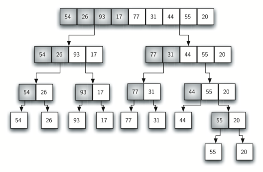
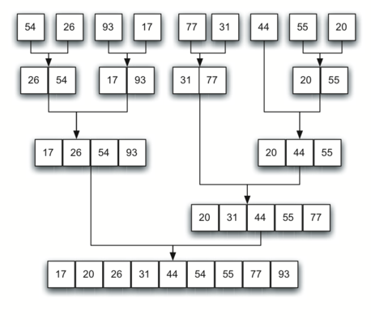

..  Copyright (C)  Dave Parillo.  Permission is granted to copy, distribute
    and/or modify this document under the terms of the GNU Free Documentation
    License, Version 1.3 or any later version published by the Free Software
    Foundation; with Invariant Sections being Forward, and Preface,
    no Front-Cover Texts, and no Back-Cover Texts.  A copy of
    the license is included in the section entitled "GNU Free Documentation
    License".
.. This file is adapted from the OpenDSA eTextbook project. See
   Copyright (C)  Brad Miller, David Ranum, and Jan Pearce
   This work is licensed under the Creative Commons Attribution-NonCommercial-ShareAlike 4.0 International License. To view a copy of this license, visit http

.. _sort_merge:

Merge sort
==========
We now turn our attention to using a :term:`divide and conquer` strategy as a
way to improve the performance of sorting algorithms. The first
algorithm we will study is the **merge sort**. Merge sort is a recursive
algorithm that continually splits a vector in half. If the vector is empty
or has one item, it is sorted by definition (the base case). If the vector
has more than one item, we split the vector and recursively invoke a merge
sort on both halves. Once the two halves are sorted, the fundamental
operation, called a **merge**, is performed. Merging is the process of
taking two smaller sorted vectors and combining them together into a
single, sorted, new vector. :ref:`Figure 10 <fig_mergesortA>` shows our familiar example
vector as it is being split by ``mergeSort``. :ref:`Figure 11 <fig_mergesortB>` shows
the simple vectors, now sorted, as they are merged back together.

.. _fig_mergesortA:

   Figure 10: Splitting the vector in a Merge Sort

.. _fig_mergesortB:

   Figure 11: vectors as They Are Merged Together

.. tb-group::
   :name: lst_merge

   .. tb-tab:: Merge Sort

      The ``merge_sort`` function begins by checking the base case.
      If the length of the vector is less than or equal to one, 
      then we already have a sorted vector and no more processing is needed.
      If the length is greater than one,
      then we extract the left and right halves.
      It is important to note that the vector may not have an even
      number of items. That does not matter, as the lengths will differ by at
      most one.

      Once the ``merge_sort`` function is invoked on the left half and the
      right half (lines 23-24), it is assumed they are sorted. The rest of the
      function is responsible for merging the two smaller sorted
      vectors into a larger sorted vector. Notice that the merge operation places
      the items back into the original vector (``data``) one at a time by
      repeatedly taking the smallest item from the sorted vectors.

      The print function shows the vector contents at the start of
      each invocation. There is also a print call at the end to show
      the merging process. The output shows the result of executing the
      function on our example vector. 

      Note that the vector with 44, 55, and 20
      will not divide evenly. The first split gives [44] and the second gives
      [55,20]. It is easy to see how the splitting process eventually yields a
      vector that can be immediately merged with other sorted vectors.

   .. tb-tab:: Run It

      .. tb-code:: cpp
         :name: lst_merge_cpp
         :caption: The Merge Sort

         #include <iostream>
         #include <string>
         #include <vector>
         using std::cout;
         using std::vector;

         void print(const vector<int>& data) {
            for (const auto& value: data) {
               cout << value << ' ';
            }
            cout << '\n';
         }

         vector<int> merge_sort(vector<int> data) {
            cout << "Splitting ";
            print(data);
            if (data.size() > 1) {
               int mid = data.size() / 2;
               // split data into 2 halves
               vector<int> left(data.begin(),data.begin()+mid);
               vector<int> right(data.begin()+mid,data.end());

               left = merge_sort(left);
               right = merge_sort(right);

               int i = 0, j = 0, k = 0;
               while (i < int(left.size()) && j < int(right.size())) {
                  if(left[i] < right[j]) {
                     data[k] = left[i];
                     ++i;
                  } else {
                     data[k] = right[j];
                     ++j;
                  }
                  ++k;
               }
               while(i < int(left.size())) {
                  data[k] = left[i];
                  ++i;
                  ++k;
               }
               while(j < int(right.size())) {
                  data[k] = right[j];
                  ++j;
                  ++k;
               }
            }
            cout << "Merging ";
            print(data);

            return data;
         }

         int main() {
           vector<int> data = {54, 26, 93, 17, 77, 31, 44, 55, 20};
           print(merge_sort(data));
           return 0;
         }

In the following animations, purple marks a range being split, teal marks the
range being merged, yellow marks the target slot currently filled, and gray
marks merged ranges.

.. Sort animation assets are generated with ``generate_sort_video.py``.

.. only:: html

   .. tb-group::
      :name: merge-sort-animations

      .. tb-tab:: Average case

         .. tb-video:: ../_static/generated/sort/merge-sort-average.webm
            :name: merge-sort-average-video
            :width: 660
            :height: 385
            :thumbnail: ../_static/generated/sort/merge-sort-average.png

      .. tb-tab:: Best case

         .. tb-video:: ../_static/generated/sort/merge-sort-best.webm
            :name: merge-sort-best-video
            :width: 660
            :height: 385
            :thumbnail: ../_static/generated/sort/merge-sort-best.png

      .. tb-tab:: Worst case

         .. tb-video:: ../_static/generated/sort/merge-sort-worst.webm
            :name: merge-sort-worst-video
            :width: 660
            :height: 385
            :thumbnail: ../_static/generated/sort/merge-sort-worst.png

.. only:: not html

   .. figure:: ../_static/generated/sort/merge-sort-average.png
      :alt: Merge sort summary for an average input.

   .. figure:: ../_static/generated/sort/merge-sort-best.png
      :alt: Merge sort summary for an already sorted input.

   .. figure:: ../_static/generated/sort/merge-sort-worst.png
      :alt: Merge sort summary for a reverse-sorted input.

Merge sort analysis
-------------------

In order to analyze the ``merge_sort`` function, we need to consider the
two distinct processes that make up its implementation. 
First, the vector is split into halves.
We already computed (in a binary search) that we can divide a vector in half 
:math:`\log n` times where *n* is the length of the vector.
The second process is the merge.
Each item in the vector will eventually be processed and 
placed on the sorted vector. 
So the merge operation which results in a vector of size *n* requires *n*
operations. 
The result of this analysis is that :math:`\log n` splits,
each of which costs :math:`n` for a total of :math:`n\log n` operations. 
A merge sort is an :math:`O(n \cdot log n)` algorithm and even better,
it is also :math:`\Omega(n \cdot log n)` in the worst case.

Recall that the slicing operator is :math:`O(k)` where k is the size
of the slice. In order to guarantee that ``merge_sort`` will be
:math:`O(n \cdot log n)` we will need to remove the slice operator. Again,
this is possible if we simply pass the starting and ending indices along
with the vector when we make the recursive call. We leave this as an
exercise.

It is important to notice that the ``merge_sort`` function requires extra
space to hold the two halves as they are extracted with the slicing
operations. This additional space can be a critical factor if the vector
is large and can make this sort problematic when working on large data sets.

**Self Check**

.. tb-group::
   :name: tab_check

   .. tb-tab:: Q1

      .. tb-choice::
         :name: question_sort_5

         Given the following list of numbers: [21, 1, 26, 45, 29, 28, 2, 9, 16, 49, 39, 27, 43, 34, 46, 40] which answer illustrates the list to be sorted after 3 recursive calls to mergesort?

         - [ ] [16, 49, 39, 27, 43, 34, 46, 40]

           This is the second half of the list.
         - [x] [21,1]

           Yes, mergesort will continue to recursively move toward the beginning of the list until it hits a base case.
         - [ ] [21, 1, 26, 45]

           Remember mergesort doesn't work on the right half of the list until the left half is completely sorted.
         - [ ] [21]

           This is the list after 4 recursive calls

   .. tb-tab:: Q2

      .. tb-choice::
         :name: question_sort_6

         Given the following list of numbers: [21, 1, 26, 45, 29, 28, 2, 9, 16, 49, 39, 27, 43, 34, 46, 40] which answer illustrates the first two lists to be merged?

         - [ ] [21, 1] and [26, 45]

           The first two lists merged will be base case lists, we have not yet reached a base case.
         - [ ] [[1, 2, 9, 21, 26, 28, 29, 45] and [16, 27, 34, 39, 40, 43, 46, 49]

           These will be the last two lists merged
         - [x] [21] and [1]

           The lists [21] and [1] are the first two base cases encountered by mergesort and will therefore be the first two lists merged.
         - [ ] [9] and [16]

           Although 9 and 16 are next to each other they are in different halves of the list starting with the first split.

.. admonition:: More to Explore

   - TBD

.. topic:: Acknowledgements

   This section is adapted from 
   `Problem Solving with Algorithms and Data Structures using C++ <https://runestone.academy/ns/books/published/cppds/index.html?mode=browsing>`__,
   by Brad Miller and David Ranum, Luther College, and Jan Pearce, Berea College
   released under the 
   `CC BY-NC-SA 4.0 <https://creativecommons.org/licenses/by-nc-sa/4.0/>`__.
