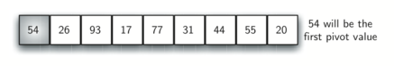
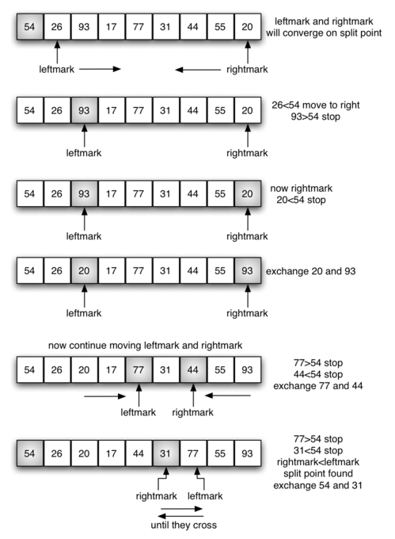
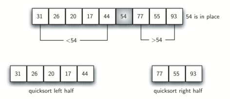

..  Copyright (C)  Dave Parillo.  Permission is granted to copy, distribute
    and/or modify this document under the terms of the GNU Free Documentation
    License, Version 1.3 or any later version published by the Free Software
    Foundation; with Invariant Sections being Forward, and Preface,
    no Front-Cover Texts, and no Back-Cover Texts.  A copy of
    the license is included in the section entitled "GNU Free Documentation
    License".
.. This file is adapted from the OpenDSA eTextbook project. See
.. http://opendsa.org for more details.
.. Copyright (c) 2012-2020 by the OpenDSA Project Contributors, and
.. distributed under an MIT open source license.

.. _sort_quick:

Quick sort
==========
The **quick sort** uses divide and conquer to gain the same advantages
as the merge sort, while not using additional storage. As a trade-off,
however, it is possible that the list may not be divided in half. When
this happens, we will see that performance is diminished.

A quick sort first selects a value, which is called the **pivot value**.
Although there are many different ways to choose the pivot value, we
will simply use the first item in the list. The role of the pivot value
is to assist with splitting the list. The actual position where the
pivot value belongs in the final sorted list, commonly called the
**split point**, will be used to divide the list for subsequent calls to
the quick sort.

:ref:`Figure 12 <fig_splitvalue>` shows that 54 will serve as our first pivot value.
Since we have looked at this example a few times already, we know that
54 will eventually end up in the position currently holding 31. The
**partition** process will happen next. It will find the split point and
at the same time move other items to the appropriate side of the list,
either less than or greater than the pivot value.

.. _fig_splitvalue:

   Figure 12: The First Pivot Value for a Quick Sort

Partitioning begins by locating two position markers - let's call them
``leftmark`` and ``rightmark`` - at the beginning and end of the remaining
items in the list (positions 1 and 8 in :ref:`Figure 13 <fig_partitionA>`). The goal
of the partition process is to move items that are on the wrong side
with respect to the pivot value while also converging on the split
point. :ref:`Figure 13 <fig_partitionA>` shows this process as we locate the position
of 54.

.. _fig_partitionA:

   Figure 13: Finding the Split Point for 54

We begin by incrementing ``leftmark`` until we locate a value that is
greater than the pivot value. We then decrement ``rightmark`` until we
find a value that is less than the pivot value. At this point we have
discovered two items that are out of place with respect to the eventual
split point. For our example, this occurs at 93 and 20. Now we can
exchange these two items and then repeat the process again.

At the point where ``rightmark`` becomes less than ``leftmark``, we
stop. The position of ``rightmark`` is now the split point. The pivot
value can be exchanged with the contents of the split point and the
pivot value is now in place (:ref:`Figure 14 <fig_partitionB>`). In addition, all the
items to the left of the split point are less than the pivot value, and
all the items to the right of the split point are greater than the pivot
value. The list can now be divided at the split point and the quick sort
can be invoked recursively on the two halves.

.. _fig_partitionB:

   Figure 14: Completing the Partition Process to Find the Split Point for 54

.. tb-group::
   :name: lst_quick_sort

   .. tb-tab:: Quick Sort

      The ``partition`` function implements the process described earlier.
      The following program sorts the 
      list that was used in the example above.

   .. tb-tab:: Run It

      .. tb-code:: cpp
         :name: lst_quick_cpp
         :caption: The Quick Sort

         #include <iostream>
         #include <string>
         #include <utility>
         #include <vector>
         using std::vector;

         void print(const vector<int>& data) {
            for (const auto& value: data) {
               std::cout << value << ' ';
            }
            std::cout << '\n';
         }

         template <typename RandomIt>
         RandomIt partition(RandomIt first, RandomIt last) {
            if (first == last) return first;

            auto pivotvalue = *first;
            RandomIt leftmark  = first + 1;
            RandomIt rightmark = last - 1;
            bool done = false;
            while (!done) {
               while(leftmark <= rightmark &&
                     *leftmark <= pivotvalue) {
                 ++leftmark;
               }
               while(rightmark >= leftmark &&
                     *rightmark >= pivotvalue) {
                 --rightmark;
               }
               if(rightmark<leftmark) {
                  done = true;
               } else {
                  std::swap(*rightmark, *leftmark);
               }
            }
            std::swap(*rightmark, *first); //*
            return rightmark;
         }

         template <typename RandomIt>
         void quick_sort(RandomIt first, RandomIt last)
         {
            if (std::distance(first, last) > 1) {
                 RandomIt pivot = partition(first, last);
                 quick_sort(first, pivot);
                 quick_sort(pivot + 1, last);
            }
         }

         int main() {
           vector<int> data = {54, 26, 93, 17, 77, 31, 44, 55, 20};
           quick_sort(data.begin(), data.end());
           print(data);
           return 0;
         }

The following animations show quick sort in action. Yellow marks the current
pivot, red marks values being compared or exchanged, teal marks a scan
boundary, and gray marks pivot values that have been placed.

.. Sort animation assets are generated with ``generate_sort_video.py``.

.. only:: html

   .. tb-group::
      :name: quick-sort-animations

      .. tb-tab:: Average case

         .. tb-video:: ../_static/generated/sort/quick-sort-average.webm
            :name: quick-sort-average-video
            :width: 660
            :height: 385
            :thumbnail: ../_static/generated/sort/quick-sort-average.png

      .. tb-tab:: Best case

         .. tb-video:: ../_static/generated/sort/quick-sort-best.webm
            :name: quick-sort-best-video
            :width: 660
            :height: 385
            :thumbnail: ../_static/generated/sort/quick-sort-best.png

      .. tb-tab:: Worst case

         .. tb-video:: ../_static/generated/sort/quick-sort-worst.webm
            :name: quick-sort-worst-video
            :width: 660
            :height: 385
            :thumbnail: ../_static/generated/sort/quick-sort-worst.png

.. only:: not html

   .. figure:: ../_static/generated/sort/quick-sort-average.png
      :alt: Quick sort summary for an average input.

   .. figure:: ../_static/generated/sort/quick-sort-best.png
      :alt: Quick sort summary for an already sorted input.

   .. figure:: ../_static/generated/sort/quick-sort-worst.png
      :alt: Quick sort summary for a reverse-sorted input.

Quick sort analysis
-------------------

To analyze the ``quick_sort`` function, note that for a list of length
*n*, if the partition always occurs in the middle of the list, there
will again be :math:`\log n` divisions. In order to find the split
point, each of the *n* items needs to be checked against the pivot value. 
Therefore, the average case complexity is :math:`n\cdot \log n`. 
In addition, there is no copying of list data as in the merge sort process.

The ideal pivot selection point is the median **value** in the data set,
however the cost to find the median often exceeds the benefits for many typical
data sets.

Unfortunately, in the worst case, the split points may not be in the
middle and can be very skewed to the left or the right, leaving a very
uneven division. In this case, sorting a list of *n* items divides into
sorting a list of 0 items and a list of :math:`n-1` items. Then
sorting a list of :math:`n-1` divides into a list of size 0 and a list
of size :math:`n-2`, and so on. The result is an :math:`O(n^{2})`
sort with all of the overhead that recursion requires.
This worst case example is shown in the above code example.

A recursive :math:`O(n^{2})` algorithm makes quick sort susceptible to
stack overflow errors on very large data sets.

Quick sort therefore poses an interesting dilemma.
The quick sort average case is very fast.
It tends to be the fastest, on average, of the known :math:`O(n \cdot log{n})`
average case sorting algorithms in actual clock time.
But its worst case is just dreadful.

So the suitability of quick sort winds up coming down to a question of
how often we would actually expect to encounter the worst case or 
*nearly* worst case behavior.
That, in turn, depends upon the choice of pivot.

We mentioned earlier that there are different ways to choose the pivot
value. In particular, we can attempt to alleviate some of the potential
for an uneven division by using a technique called **median of three**.
To choose the pivot value, we will consider the first, the middle, and
the last element in the list. In our example, those are 54, 77, and 20.
Now pick the median value, in our case 54, and use it for the pivot
value (of course, that was the pivot value we used originally). The idea
is that in the case where the first item in the list does not belong
toward the middle of the list, the median of three will choose a better
"middle" value. This will be particularly useful when the original list
is somewhat sorted to begin with. We leave the implementation of this
pivot value selection as an exercise.

**Self Check**

.. tb-group::
   :name: tab_check

   .. tb-tab:: Q1

      .. tb-choice::
         :name: question_sort_7

         Given the following list of numbers
         [14, 17, 13, 15, 19, 10, 3, 16, 9, 12] which answer shows the 
         contents of the list after the second partitioning according to the
         quicksort algorithm?

         - [ ] [9, 3, 10, 13, 12]

           It's important to remember that quicksort works on the entire list and sorts it in place.
         - [ ] [9, 3, 10, 13, 12, 14]

           Remember quicksort works on the entire list and sorts it in place.
         - [ ] [9, 3, 10, 13, 12, 14, 17, 16, 15, 19]

           The first partitioning works on the entire list, and the second partitioning works on the left partition not the right.
         - [x] [9, 3, 10, 13, 12, 14, 19, 16, 15, 17]

           The first partitioning works on the entire list, and the second partitioning works on the left partition.

   .. tb-tab:: Q2

      .. tb-choice::
         :name: question_sort_8

         Given the following list of numbers 
         [1, 20, 11, 5, 2, 9, 16, 14, 13, 19] 
         what would be the first pivot value using the median of 3 method?

         - [ ] 1

           The three numbers used in selecting the pivot are 1, 9, 19.  1 is not the median, and would be a very bad choice for the pivot since it is the smallest number in the list.
         - [x] 9

           Good job.
         - [ ] 16

           although 16 would be the median of 1, 16, 19 the middle is at len(list) // 2.
         - [ ] 19

           the three numbers used in selecting the pivot are 1, 9, 19.  9 is the median.  19 would be a bad choice since it is almost the largest.

   .. tb-tab:: Q3

      .. tb-choice::
         :name: question_sort_9

         Which of the following sort algorithms are guaranteed to be 
         O(n log n) even in the worst case?

         - [ ] Shell Sort

           Shell sort is between O(n) and O(n^2)
         - [ ] Quick Sort

           Quick sort can be O(n log n), but if the pivot points are not well chosen and the list is just so, it can be O(n^2).
         - [x] Merge Sort

           Merge Sort is the only guaranteed O(n log n) even in the worst case. The cost is that merge sort uses more memory.
         - [ ] Insertion Sort

           Insertion sort is O(n^2)

   .. tb-tab:: Q4

      .. tb-match::
         :name: question_sort_10

         Match each sorting method with its appropriate estimated comparisons.

         Quick Sort
            O(n log n) or O(n^2)
         Insertion/Bubble/Merge
            O(n^2)
         Merge Sort
            O(n log n)
         Shell Sort
            between O(n) and O(n^2)

   .. tb-tab:: Q5

      .. tb-choice::
         :name: sortefficiencyrandom

         Which sort should you use for best efficiency
         if you need to sort through 100,000 random items in a list?

         - [x] Merge

           Correct!
         - [ ] Selection

           Selection sort is inefficient in large lists.
         - [ ] Bubble

           Bubble sort works best with mostly sorted lists.
         - [ ] Insertion

           Insertion sort works best with either small or mostly sorted lists.

.. admonition:: More to Explore

   - TBD

.. topic:: Acknowledgements

   This section is adapted from 
   `Problem Solving with Algorithms and Data Structures using C++ <https://runestone.academy/ns/books/published/cppds/index.html?mode=browsing>`__,
   by Brad Miller and David Ranum, Luther College, and Jan Pearce, Berea College
   released under the 
   `CC BY-NC-SA 4.0 <https://creativecommons.org/licenses/by-nc-sa/4.0/>`__.
