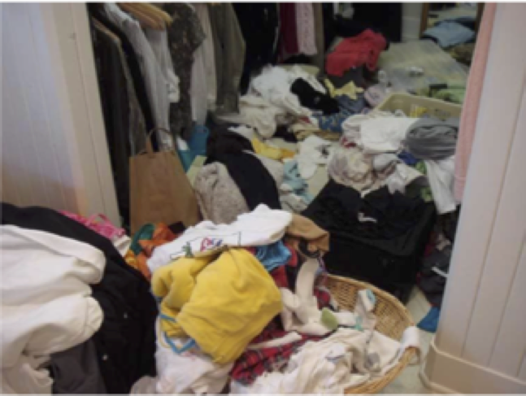
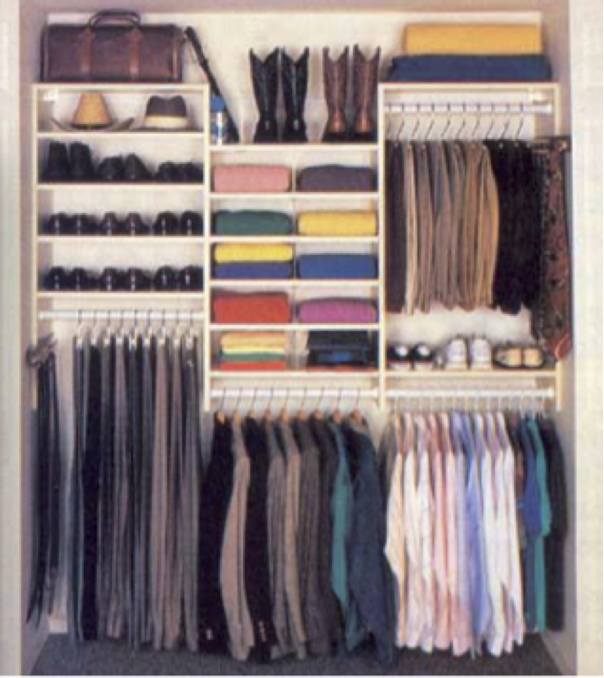

..  Copyright (C)  Dave Parillo.  Permission is granted to copy, distribute
    and/or modify this document under the terms of the GNU Free Documentation
    License, Version 1.3 or any later version published by the Free Software
    Foundation; with Invariant Sections being Forward, and Preface,
    no Front-Cover Texts, and no Back-Cover Texts.  A copy of
    the license is included in the section entitled "GNU Free Documentation
    License".

.. index:: associative containers
   single: trees

.. _trees_trees:

Tree ADT concepts
=================
If sequence containers like :container:`vector` are so great,
then why would we need anything else?

In a word: search.

When we have millions of elements in a data structure and need to find
just one element, or a specific range of elements,
we *could* use a ``vector``.

Appending elements is fast.
No matter how many elements are already in a ``vector``
adding one more using :container:`push_back <vector/push_back>` takes
amortized constant time. An occasional reallocation takes linear time,
but the average cost over a sequence of appends is :math:`O(1)` per element.

A ``vector`` is default ordered only by its index position,
not by the values stored within it.
It's easy to keep throwing items in without paying any attention
to how they are ordered.

But always using ``push_back`` is analogous to a messy closet.
We could consider the closet to be ordered by *depth*:
the last things thrown in the closet are on the top of the pile.

This makes getting a specific item from the closet slow.
If we only ever want to access the last item we added,
then we know exactly where to go.
But if we want to find some arbitrary item,
we have to search the vector 1 element at a time until we find it.

.. tb-code:: cpp
   :name: trees_linear_search_ac

   #include <algorithm>
   #include <cstddef>
   #include <iostream>
   #include <numeric>
   #include <random>
   #include <vector>

   int main() {
     std::vector<int> messy_closet(1024);
     std::iota(messy_closet.begin(), messy_closet.end(), 0);
     const int search_value = 42;
     std::mt19937 engine{187};
     std::size_t total_examined = 0;
     constexpr int max_iter = 10;

     for (int trial = 1; trial <= max_iter; ++trial) {
       std::shuffle(messy_closet.begin(), messy_closet.end(), engine);

       std::size_t examined = 0;
       for (const auto value : messy_closet) {
         ++examined;
         if (value == search_value) {
           break;
         }
       }

       total_examined += examined;
       std::cout << "trial " << trial
                 << ": examined " << examined << " elements\n";
     }

     std::cout << "average examined: "
               << static_cast<double>(total_examined) / max_iter << "\n";
   }

Sometimes we may get lucky and find the desired element at index position 0.
If the data added to the vector is random and the searched value is present,
then finding it near the beginning becomes increasingly less likely as the
size grows.

We might sometimes get very unlucky and not find the element until we access
the last element.
Over many successful searches whose positions are uniformly distributed,
we will examine :math:`N \over 2` elements on average. An unsuccessful search
examines all :math:`N` elements.

It's easy to see that the more elements are added, 
the longer searches will take.

We need a tidy closet.

We could sort the ``vector``, which would speed up our search.
The basic idea is to sort the vector, then examine the middle element
of the current search range. If the middle value is greater than the value
we are looking for, continue in the lower half; otherwise, continue in the
upper half. This is the :term:`binary search` algorithm.

At each step,
we eliminate the number of remaining elements we need
to search in our ``vector`` by half.
For a large ``vector``, this saves a lot of time.

This technique requires that we keep the vector sorted.
If elements are added or removed frequently,
then adding data to our vector, which used to be fast, is now slow.
We can use :container:`push_back <vector/push_back>` followed by
:algorithm:`sort`, which costs :math:`O(N \log N)` for each update,
or use :algorithm:`lower_bound` to find the insertion position.
The binary search then takes :math:`O(\log N)` comparisons, but inserting
into the middle of a vector still requires :math:`O(N)` element movement.

How can we solve this problem?

Can we make an :term:`ADT` whose performance does not degrade
as the number of elements in the :term:`ADT` grows large?

Yes, but we need a new idea.
Instead of a sequential container, we need a :term:`tree`.

The tree ADT
------------
A :term:`tree` is a *hierarchical* abstract data type.
Conceptually, it can be thought of as a collection of
*nodes* defined by parent-child relationships.

One node is the :term:`root`.
It serves as the 'trunk' of the tree and serves the same
function as the :term:`head` of a :term:`list`.
The root node is the *only* node in a tree without a parent.
Every other node in a tree has exactly one parent.
In a :term:`binary tree`, the children are commonly referred to as the
**left child** and **right child**, or as the left and right subtrees.

.. digraph:: a_tree
   :alt: A simple binary tree

   graph [
          labelloc=b;
          label="A simple binary tree";
       ];

   node [fontname = "Bitstream Vera Sans", fontsize=14,
                 style=filled, fillcolor=lightblue]

   root -> left,right [dir=none];

Yes, programmers draw trees upside-down.
The :term:`root` is above the branches.

The :term:`height` of a tree is the number of edges along the longest path
from the :term:`root` to a :term:`leaf node`. A tree containing only a root
has height 0.

.. digraph:: larger
   :alt: A tree of height 3

   graph [
          nodesep=0.25, ranksep=0.3, splines=line;
          labelloc=b;
          label="A tree of height 3";
       ];
   node [fontname = "Bitstream Vera Sans", fontsize=14,
         style=filled, fillcolor=lightblue,
         shape=circle, fixedsize=true, width=0.3];
   edge [weight=1, arrowsize=0.5, dir=none];

   a, b, am, c, d, bm, e, f, cm, g, h, dm, i, j, em, k, l, fm, m;
   am, bm, cm, dm, em, fm [style=invis, label=""];

   a->b [color=red, penwidth=2, dir=forward];
   a->c;
   b->d [weight=2]; // nudge b: trees b & c are not balanced
   b->e [color=red, penwidth=2, dir=forward];
   c->f,g;
   d->h,i;
   e->j [color=red, penwidth=2, dir=forward];
   e->k;
   f->l,m;

   edge [style=invis, weight=100];
   d->dm; 
   e->em;
   b->bm;
   f->fm;
   c->cm;
   a->am;
   
Although there are many different types of trees,
this chapter focuses on :term:`binary trees <binary tree>`.
A :term:`binary tree` is a tree in which no node has more than 2 children.
Any tree node may have 0, 1, or 2 children.
A tree node with no children is a :term:`leaf node`.

All of these are valid :term:`binary trees <binary tree>`:

.. graph:: example_trees
   :alt: example binary trees

   graph [color=white;
          labelloc=b;
          ranksep=0.25;
          labelloc=b;
          fontsize=14;
          label="Example binary trees";
    ];

    node [shape=circle, height=0.1, label="",
                  style=filled, fillcolor=lightblue
    ];

    subgraph cluster_0 {
      label="";
      one;
    }

    subgraph cluster_1 {
      label="";
      a -- b;
      c [style=invis];
      a -- c [style=invis];
    }

    subgraph cluster_2 {
      label="";
      e [style=invis];
      d -- e [style=invis];
      d -- f;
    }

    subgraph cluster_3 {
      label="";
      root -- left;
      root -- right;
    }

    subgraph cluster_4 {
      label="";
      l -- m -- n -- o -- p -- q -- r;
      node [style=invis];
      edge [weight=2, style=invis];
      c1 -- c2 -- c3 -- c4 --c5 --c6 -- c7 [constraint=false];
      c1 -- l
      c2 -- m
      c3 -- n
      c4 -- o
      c5 -- p
      c6 -- q
      c7 -- r
   
      {rank=same; c1 c2 c3 c4 c5 c6 c7};
    }

    subgraph cluster_5 {
      label="";
      1, 2, m1, 3, 4, m2, 5, m3, 7, 8, m5, 9, 10, m9, 11, m10, 12;
      m1, m2, m3, m5, m9, m10 [style=invis];

      1 -- 2,3;
      2 -- 4,5;
      3 -- 7;
      5 -- 8,9;
      9 -- 10;
      10 -- 11,12;
      edge [weight=2, style=invis];
      1 -- m1;
      2 -- m2;
      3 -- m3;
      5 -- m5;
      9 -- m9;
      10 -- m10;
    }

    edge [style=invis];
    c -- root;
    f -- 1;

A roughly balanced binary search tree, one whose subtree heights remain
reasonably similar, provides the tidy structure we need for fast inserts
and retrievals. Balance alone is not enough: the tree must also maintain
the binary search tree ordering property for key-based search.

When a binary search tree is balanced,
search, insertion, and removal take :math:`O(\log N)` time under the usual
balanced-tree guarantees. Binary trees provide a way for us to formalize
our half-splitting solution.

Unbalanced search trees are not much more than fancy
:term:`linked lists <linked list>`.
The performance of unbalanced trees degrades
back to the messy room,
with all of the problems and none of the benefits.

The C++ standard specifies the behavior and complexity of ``std::set`` and
``std::map``; it does not require a particular implementation.
However, balanced search trees are commonly used to implement ordered sets and
maps.

-----

.. admonition:: More to Explore

   - MyCodeSchool video: 
     `Data structures: introduction to trees <https://www.youtube.com/watch?v=qH6yxkw0u78&list=PL2_aWCzGMAwI3W_JlcBbtYTwiQSsOTa6P&index=25>`__ 
   - :cpp:`C++ standard library containers <container>`
   - `Visualgo: binary heap <https://visualgo.net/en/heap?slide=1>`_
   - :wiki:`Wikipedia: binary search algorithm <Binary_search_algorithm>`
